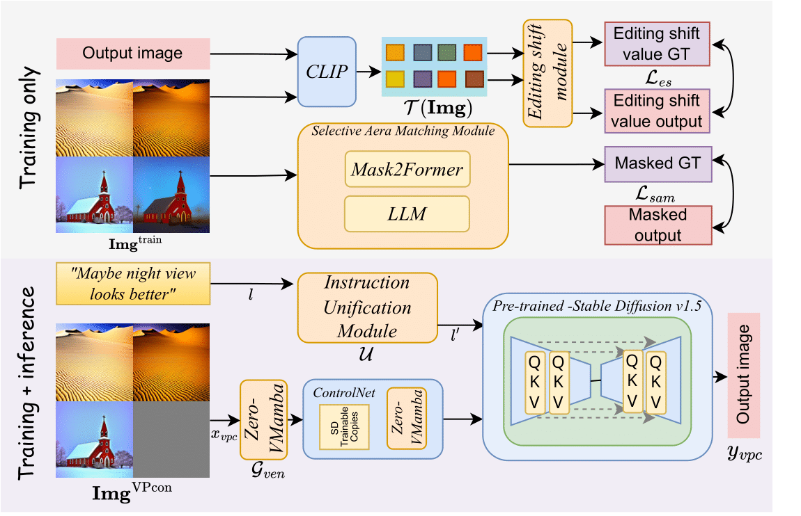

# InstructGIE: Towards Generalizable Image Editing (ECCV 2024)


<p align="center">
  <a href='https://arxiv.org/abs/2403.05018'>
    
  </a>
  <a href='https://arxiv.org/pdf/2403.05018.pdf'>
    
  </a>
  <a href='https://cr8br0ze.github.io/InstructGIE/'>
  </a>
  <a href='https://github.com/cr8br0ze/InstructGIE-Code'>
    </a>
  <a href="" target='_blank'>
    
  </a>
</p>


<p align="center">
<strong>InstructGIE: Towards Generalizable Image Editing</strong></h1>
   <p align="center">
    <a href='https://cr8br0ze.github.io' target='_blank'>Zichong Meng*</a>&emsp;
    <a href='https://scholar.google.com/citations?user=aZvLu6wAAAAJ' target='_blank'>Changdi Yang*</a>&emsp;
    <a href='https://scholar.google.com/citations?user=RaQLRNgAAAAJ' target='_blank'>Jun Liu</a>&emsp;
    <a href='https://ha0tang.github.io/' target='_blank'>Hao Tang</a>&emsp;
    <a href='https://puzhao.info/' target='_blank'>Pu Zhao</a>&emsp;
    <a href='https://web.northeastern.edu/yanzhiwang/' target='_blank'>Yanzhi Wang</a>&emsp;
    <br>
    Northeastern University &emsp; Carnegie Mellon University &emsp; Peking Univeristy &emsp;
    <br>
    ECCV 2024
  </p>
</p>


## 📜 TODO List
- [x] Release InstructGIE dataset (filtered and processed).
- [ ] Release the main codes for implementation.
- [ ] Release the evaluation codes and the pretrained models.

## 📥 InstructGIE Dataset

InstructGIE dataset can be obtained with from the following link [InstructGIE dataset link](https://drive.google.com/file/d/1GZ3fmQV0a9aoKIRP6REpJ6EGI9W24vVm/view?usp=sharing).


## 🤝 Citation
If you find this repository useful for your work, please consider citing it as follows:
```bibtex
@article{meng2024instructgie,
  title={InstructGIE: Towards Generalizable Image Editing},
  author={Meng, Zichong and Yang, Changdi and Liu, Jun and Tang, Hao and Zhao, Pu and Wang, Yanzhi},
  journal={arXiv preprint arXiv:2403.05018},
  year={2024}
}
```
